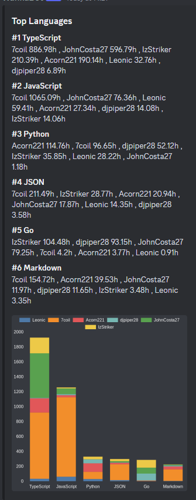

# WakaBot

Cross Platform Discord bot for [WakaTime](https://wakatime.com) programming metrics. Currently can only run in a single discord server at a time.

[Click Here](https://discord.com/oauth2/authorize?client_id=955935991087128596&permissions=274878036992&scope=bot%20applications.commands) to add to your server.

### Commands

#### /Rank [timerange: All Time | Last 7 Days | Last 30 Days | Last 6 Months] default All Time

Shows the rank of the top users in terms of programming time in your discord server with accompanying pie chart. You can optionally specify a time range option which will show the rank of the top users in that time range. To use the time range option, have signed up using OAuth.

#### /toplangs

Show the top programming languages used by members of your discord server with accompanying stacked bar chart.

#### /profile user: @user

Show the programming metrics and other interesting information about a user in your discord server with an accompanying pie chart showing the users top languages.

#### /languagestats language: language

Show a pie chart of the top users in your discord server for the particular programming language.

x

#### /project user: @user [time-range: All Time | Last 7 Days | Last 30 Days | Last 6 Months] default All Time

Shows the top projects of a user in your discord server with an accompanying pie chart. You can optionally specify a time range option which will show the top projects of a user in that time range. This command can only be used if you have signed up using OAuth.

#### /help

Show the help menu.

### Getting Started

[Click Here](https://discord.com/oauth2/authorize?client_id=955935991087128596&permissions=274878036992&scope=bot%20applications.commands) to add to your server. Sign up to [WakaTime](https://wakatime.com) if you haven't already and use the `/user register` command to register your discord account with your WakaTime account. You can then use the commands above to view programming metrics of users in your discord server.

Signing up using OAuth is optional but allows the Wakabot to access more information about your WakaTime account such as projects and get specific time ranges. To sign up using OAuth, use the `/user register` command, set useOAuth to true and command and follow the instructions.

### Discord Permissions

Requires the following permissions

- View Channels

- Send Messages

- Attach Files

- Read Message History

### Contributing and Feedback

Contributions are welcome. Feel free to open an issue or submit a pull request. If you have any feedback or suggestions, feel free to open an issue.
